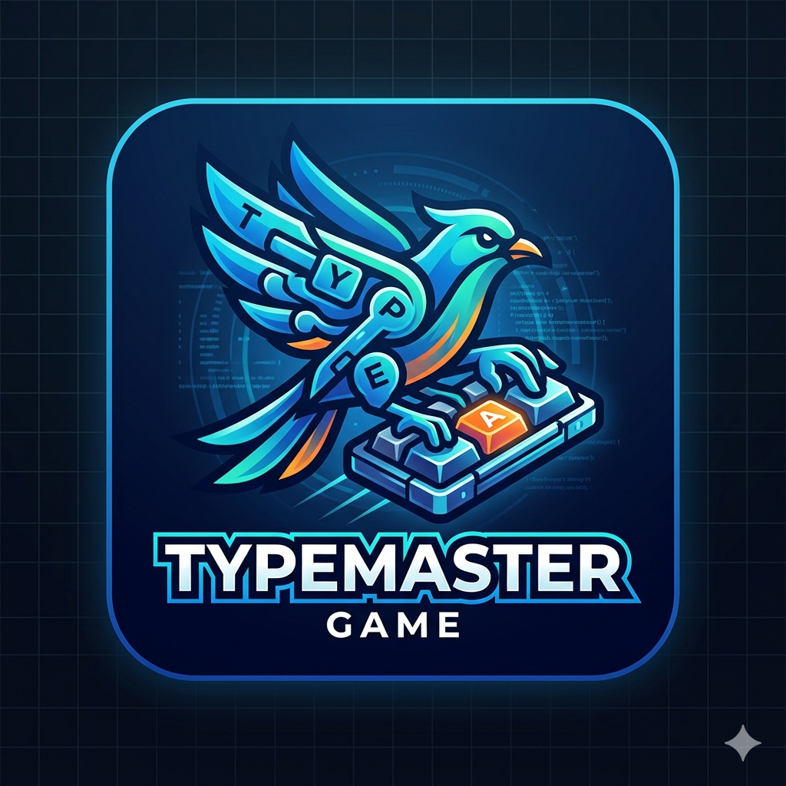

# Ropetyper

<p align="center">
  
</p>

Ropetyper is an Android typing game designed to improve your WPM and accuracy through engaging, interactive gameplay. Challenge yourself across multiple difficulty levels and track your progress.

## Features

- **Typing Practice**: Improve your WPM (words per minute) and accuracy
- **Interactive Gameplay**: Fun game mechanics that keep you engaged
- **Progress Tracking**: Monitor your improvement over time
- **Multiple Difficulty Levels**: Challenge yourself as you improve
- **Clean UI**: Simple and intuitive interface

## Installation

### Download APK

1. Download the latest `Ropetyper.apk` from the releases section
2. Enable "Install from Unknown Sources" in your Android settings
3. Open the APK file and follow the installation prompts

### Build from Source

```bash
# Clone the repository
git clone https://github.com/yourusername/ropetyper.git

# Navigate to project directory
cd ropetyper

# Build the project (using Gradle)
./gradlew assembleDebug

# APK will be in app/build/outputs/apk/debug/
```

## Requirements

- Android 5.0 (API level 21) or higher
- Approximately 10MB storage space

## How to Play

1. Launch the app
2. Select your preferred difficulty level
3. Type the words/sentences as they appear
4. Try to maintain high accuracy and speed
5. Track your progress and beat your high scores

## Project Structure

```
ropetyper/
├── app/                    # Main application module
│   ├── src/
│   │   ├── main/
│   │   │   ├── java/       # Java/Kotlin source files
│   │   │   ├── res/        # Resources (layouts, drawables, etc.)
│   │   │   └── AndroidManifest.xml
│   │   └── androidTest/    # Instrumentation tests
│   └── build.gradle        # App-level build configuration
├── gradle/                 # Gradle wrapper
├── Ropetyper.apk          # Pre-built APK
├── .gitignore
├── LICENSE
└── README.md
```

## Contributing

Contributions are welcome! Feel free to open issues or submit pull requests.

1. Fork the repository
2. Create your feature branch (`git checkout -b feature/AmazingFeature`)
3. Commit your changes (`git commit -m 'Add some AmazingFeature'`)
4. Push to the branch (`git push origin feature/AmazingFeature`)
5. Open a Pull Request

## License

This project is licensed under the MIT License - see the [LICENSE](LICENSE) file for details.

## Acknowledgments

- Thanks to all the beta testers
- Built with passion for typing enthusiasts everywhere
